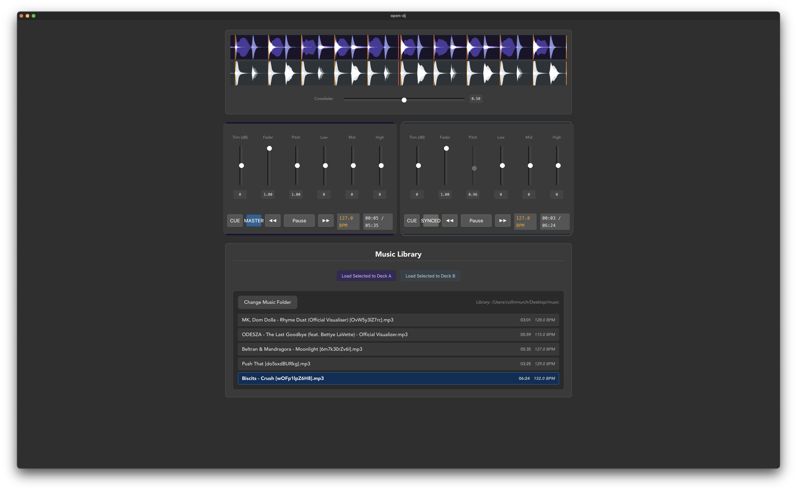

# Open DJ

## Overview

A hobby project to build a controller from scratch. Built with [Tauri 2.0](https://tauri.app) and [Svelte 5](https://svelte.dev) (TypeScript).

The ultimate goal is to get an app that allows you to mix with nothing but your keyboard.
We'll need to support all the functionality of a controller and have some clever keybinds to allow for easy transitions.
Haven't worked that last part out yet.

## Setup

### Prerequisites
- [Bun](https://bun.sh) (package manager)
- [Rust](https://rustup.rs) (for Tauri backend)

### Installation
```bash
# Install frontend dependencies
bun install

# Verify Rust code
cd src-tauri && cargo check
```

### Development
```bash
# Start development server
bun run dev

# Build for production
bun run build
```

## Screenshot


